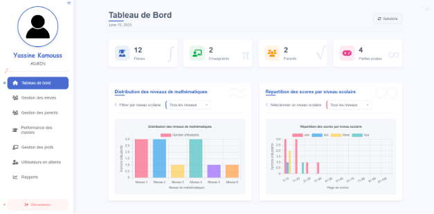

# Game Dashboard - Suivi Pédagogique Interactif


Tableau de bord web développé avec Angular 19 et Firebase Realtime Database, conçu pour le suivi des performances des étudiants dans un environnement d'apprentissage ludique des mathématiques. Cette plateforme est destinée aux enseignants, parents et administrateurs, et s'interface avec des jeux éducatifs développés séparément (Unity) et une application mobile de suivi parental.



## Table des Matières

1.  [Objectif du Projet](#objectif-du-projet)
2.  [Fonctionnalités Principales](#fonctionnalités-principales)
3.  [Stack Technologique](#stack-technologique)
4.  [Prérequis](#prérequis)
5.  [Installation](#installation)
6.  [Configuration de Firebase](#configuration-de-firebase)
7.  [Lancement de l'application](#lancement-de-lapplication)
8.  [Structure du Projet (optionnel)](#structure-du-projet-optionnel)
9.  [Interaction avec les Jeux Unity](#interaction-avec-les-jeux-unity)
10. [Contribution](#contribution)
11. [Contributeurs](#contributeurs)

## Objectif du Projet

L'objectif principal de ce projet est de fournir une interface web intuitive et efficace permettant :

- Aux **enseignants** de suivre les progrès individuels et collectifs de leurs élèves, d'identifier les difficultés et d'adapter leurs méthodes pédagogiques.
- Aux **administrateurs** de gérer les utilisateurs (élèves, enseignants, classes) et d'obtenir des statistiques globales sur l'utilisation de la plateforme.

## Fonctionnalités Principales

- **Tableaux de bord personnalisés** : Vues adaptées pour chaque type d'utilisateur (enseignant, parent, admin).
- **Suivi des performances** : Visualisation des scores, temps passé, niveaux atteints, erreurs fréquentes par matière ou par jeu.
- **Gestion des utilisateurs** : Création, modification, suppression des comptes étudiants, enseignants, parents.
- **Gestion des classes et groupes** : Organisation des étudiants pour un suivi facilité.
- **Rapports et statistiques** : Génération de rapports sur les progrès et l'engagement.
- **Notifications (potentiel)** : Alertes pour les performances notables ou les difficultés rencontrées.
- **Interface responsive** : Accessible sur ordinateurs, tablettes et smartphones.

## Stack Technologique

- **Frontend** : Angular 19 (TypeScript, HTML, SCSS)
- **Backend & Base de données** : Firebase Realtime Database
- **Authentification** : Firebase Authentication
- **Hébergement** : Firebase Hosting

## Prérequis

Avant de commencer, assurez-vous d'avoir installé les éléments suivants sur votre machine :

- [Node.js](https://nodejs.org/) (version 18.x ou 20.x recommandée)
- [npm](https://www.npmjs.com/) (généralement inclus avec Node.js) ou [Yarn](https://yarnpkg.com/)
- [Angular CLI](https://angular.io/cli) : `npm install -g @angular/cli`
- Un compte [Firebase](https://firebase.google.com/)

## Installation

1.  **Clonez le dépôt :**

    ```bash
    git clone https://github.com/yassinekamouss/game-dashboard.git
    ```

2.  **Accédez au répertoire du projet :**

    ```bash
    cd game-dashboard
    ```

3.  **Installez les dépendances :**
    ```bash
    npm install
    # ou si vous utilisez yarn
    # yarn install
    ```

## Configuration de Firebase

Pour que l'application puisse se connecter à votre instance Firebase, vous devez configurer vos clés d'API.

1.  **Créez un projet Firebase** sur la [console Firebase](https://console.firebase.google.com/).
2.  Dans votre projet Firebase, allez dans **Paramètres du projet** (Project Settings).
3.  Sous l'onglet **Général** (General), descendez jusqu'à la section "Vos applications" (Your apps).
4.  Si vous n'avez pas encore d'application web, cliquez sur l'icône web (`</>`) pour en ajouter une. Enregistrez l'application.
5.  Firebase vous fournira un objet de configuration. Copiez ces informations.
6.  **Créez les fichiers d'environnement** dans votre projet Angular :

    - `src/environments/environment.ts` (pour le développement)
    - `src/environments/environment.prod.ts` (pour la production)

    Copiez le contenu suivant dans chacun de ces fichiers et remplacez les placeholders par vos propres clés Firebase :

    ```typescript
    // src/environments/environment.ts
    export const environment = {
      production: false,
      firebase: {
        apiKey: "VOTRE_API_KEY",
        authDomain: "VOTRE_AUTH_DOMAIN",
        databaseURL: "VOTRE_DATABASE_URL_REALTIMEDB", // Important pour RealtimeDB
        projectId: "VOTRE_PROJECT_ID",
        storageBucket: "VOTRE_STORAGE_BUCKET",
        messagingSenderId: "VOTRE_MESSAGING_SENDER_ID",
        appId: "VOTRE_APP_ID",
        measurementId: "VOTRE_MEASUREMENT_ID", // Optionnel, pour Google Analytics
      },
    };

    // src/environments/environment.prod.ts
    export const environment = {
      production: true,
      firebase: {
        apiKey: "VOTRE_API_KEY_PROD", // Utilisez des clés différentes pour la prod si nécessaire
        authDomain: "VOTRE_AUTH_DOMAIN_PROD",
        databaseURL: "VOTRE_DATABASE_URL_REALTIMEDB_PROD",
        projectId: "VOTRE_PROJECT_ID_PROD",
        storageBucket: "VOTRE_STORAGE_BUCKET_PROD",
        messagingSenderId: "VOTRE_MESSAGING_SENDER_ID_PROD",
        appId: "VOTRE_APP_ID_PROD",
        measurementId: "VOTRE_MEASUREMENT_ID_PROD",
      },
    };
    ```

    **Note importante :** N'oubliez pas d'ajouter `src/environments/environment.ts` à votre fichier `.gitignore` si vous ne souhaitez pas que vos clés de développement soient versionnées. Cependant, il est courant de versionner `environment.ts` avec des clés de développement "publiques" et de gérer les clés de production via des variables d'environnement lors du build CI/CD. Pour ce projet, si vous travaillez seul, remplissez simplement les deux fichiers.

7.  **Configurez les règles de sécurité** de votre Firebase Realtime Database et Firebase Authentication pour protéger les données de vos utilisateurs.

## Lancement de l'application

- **Pour le développement :**
  Exécutez la commande suivante pour démarrer le serveur de développement Angular :

  ```bash
  ng serve
  # ou
  # npm start
  ```

  Ouvrez votre navigateur et allez sur `http://localhost:4200/`. L'application se rechargera automatiquement si vous modifiez les fichiers sources.

- **Pour la production (Build) :**
  Exécutez la commande suivante pour compiler l'application pour la production :
  ```bash
  ng build --configuration production
  ```
  Les fichiers compilés seront générés dans le répertoire `dist/game-dashboard`. Vous pourrez ensuite déployer ces fichiers sur un serveur web ou Firebase Hosting.

## Structure du Projet (optionnel)

Une brève description de l'organisation des dossiers principaux :

```bash
GAME-DASHBOARD/
├── .angular/                # Fichiers internes Angular CLI
├── .vscode/                 # Paramètres spécifiques à VS Code
├── node_modules/            # Dépendances installées via npm
├── public/                  # Fichiers publics (assets statiques, etc.)
├── src/                     # Code source principal
│   ├── app/                 # Application principale
│   │   ├── components/      # Composants réutilisables
│   │   ├── environments/    # Fichiers d'environnement (dev/prod)
│   │   ├── factories/       # Fonctions de création/initialisation
│   │   ├── models/          # Interfaces et types TypeScript
│   │   ├── services/        # Services Angular (API, logique métier)
│   │   ├── app.component.*  # Composant racine (CSS, HTML, TS, spec)
│   │   ├── app.config.ts    # Configuration de l'application
│   │   ├── app.routes.ts    # Routes principales
│   │   └── chart.config.ts  # Configuration spécifique aux graphiques
│   ├── assets/              # Fichiers statiques (images, polices, etc.)
│   ├── index.html           # Point d’entrée HTML
│   ├── main.ts              # Point d’entrée TypeScript
│   └── styles.css           # Feuille de styles globale
├── .editorconfig            # Configuration des règles d’édition
├── .gitignore               # Fichiers/dossiers à ignorer par Git
├── angular.json             # Configuration Angular CLI
├── package.json             # Fichier de configuration npm
├── package-lock.json        # Version verrouillée des dépendances
├── README.md                # Documentation du projet
├── tsconfig.app.json        # Config TypeScript pour l'application
├── tsconfig.json            # Config TypeScript principale
└── tsconfig.spec.json       # Config TypeScript pour les tests
```

## Interaction avec les Jeux Unity

Les jeux développés sous [Mathémagique](https://github.com/yassinekamouss/game-dashboard.git) sont responsables de :

1.  Authentifier l'étudiant.
2.  Collecter les données de performance pertinentes (scores, temps, erreurs, progression, etc.).
3.  Envoyer ces données structurées à **Firebase Realtime Database** sous un chemin spécifique.

Ce tableau de bord Angular lit ensuite ces données depuis Firebase Realtime Database pour les afficher et les analyser. Il est crucial que la structure des données dans Firebase soit cohérente entre les jeux et le tableau de bord.

## Contribution

Les contributions sont les bienvenues ! Si vous souhaitez contribuer :

1.  Forkez le projet (`https://github.com/yassinekamouss/game-dashboard/fork`).
2.  Créez votre branche de fonctionnalité (`git checkout -b feature/NouvelleFonctionnalite`).
3.  Commitez vos changements (`git commit -m 'Ajout de NouvelleFonctionnalite'`).
4.  Poussez vers la branche (`git push origin feature/NouvelleFonctionnalite`).
5.  Ouvrez une Pull Request.

Veuillez vous assurer que votre code respecte les conventions de style et que les tests (si présents) passent.

## Contributeurs

Merci à toutes les personnes ayant contribué à ce projet !

- [Yassine Kamouss](https://github.com/yassinekamouss) – Créateur principal
- [Yahya Ahmane](https://github.com/ahyahya1616) – Contributeur principal


Lien du Projet : [https://github.com/yassinekamouss/game-dashboard](https://github.com/yassinekamouss/game-dashboard)
